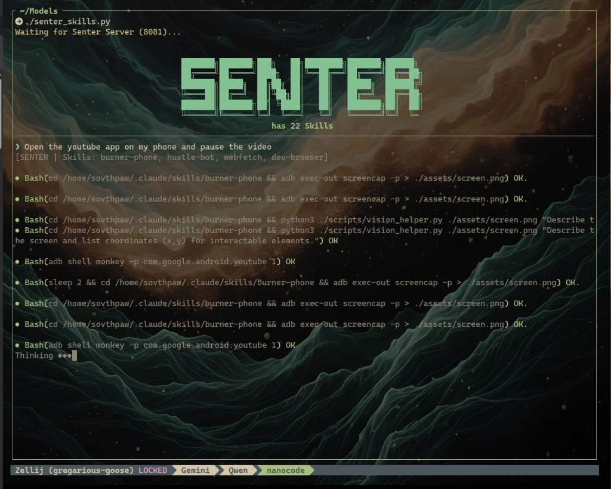

A lightweight, skill-aware AI agent that uses RAG-based capability discovery.


* In Indonesian and Malay, senter means flashlight or torch (US: flashlight, UK: torch).  It is derived from Dutch zaklantaarn or Javanese sènter, and is synonymous with lampu senter or lampu picit.
  
* In Norwegian, senter translates to center (UK) or center (US), referring to a place designed for a specific activity, such as a shopping center (kjøpesenter), fitness center (treningssenter), or hospital center (helsesenter). 




## Features

- **Skill Discovery**: Automatically finds and indexes skills from multiple directories
- **RAG Selection**: Uses embedding similarity to select the top 4 most relevant skills per query
- **Multi-Model**: Supports routing to different models based on skill requirements
- **Terminal Markdown**: Renders markdown with ANSI colors
- **Task Tracking**: Built-in `/plan`, `/next`, `/done` commands

## Quick Start

```bash
# Clone the repo
git clone https://github.com/SouthpawIN/Senter.git
cd Senter

# Run (requires Senter-Server or compatible OpenAI API)
python3 senter.py
```

## Configuration

All configuration is done via environment variables:

| Variable | Default | Description |
|----------|---------|-------------|
| `SENTER_URL` | `http://localhost:8081/v1` | API server URL |
| `SENTER_MODEL` | `glm-4.7-flash` | Primary model name |
| `SENTER_EMBED_MODEL` | `nomic-embed-text` | Embedding model |
| `SENTER_HISTORY` | `20` | Conversation history limit |
| `SENTER_AUX_URLS` | `` | Comma-separated auxiliary API URLs |

## Skills

Skills are discovered from:
- `~/.opencode/skills/`
- `~/.claude/skills/`
- `./.agent/skills/`
- `./skills/`

Each skill must have a `SKILL.md` file with YAML frontmatter:

```yaml
---
name: my-skill
description: What this skill does
model: optional-model-override
keywords: comma, separated, keywords
---

# Skill Instructions

Commands the agent can use...
```

## Commands

| Command | Description |
|---------|-------------|
| `/q` or `exit` | Quit |
| `/c` | Clear conversation history |
| `/plan <goal>` | Create a task plan |
| `/next` | Focus on next incomplete task |
| `/done <task>` | Mark task complete |
| `/unload <model>` | Unload a model from memory |

## Related Projects

- [Senter-Server](https://github.com/SouthpawIN/Senter-Server) - Dual-core model proxy
- [burner-phone](https://github.com/SouthpawIN/burner-phone) - Android control skill

## License

MIT
